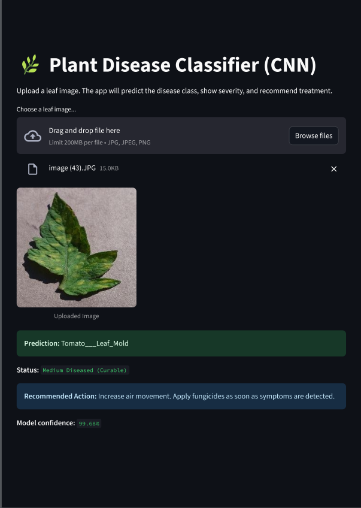

# Plant Disease

## Overview

This repository contains a complete, modular, and production-ready pipeline for classifying plant leaf diseases using a combination of classical computer vision, machine learning, deep learning (custom CNN), and transfer learning approaches. The workflow is organized for scalable research, experimentation, and real-world deployment using Streamlit.

## Table of Contents

1. [Introduction](#introduction)
2. [Features](#features)
3. [Dataset](#dataset)
4. [Project Structure](#project-structure)
5. [Installation](#installation)
6. [Usage](#usage)
   * [1. Jupyter/Colab Workflow](#1-jupytercolab-workflow)
   * [2. Streamlit App](#2-streamlit-app)
7. [Model Details](#model-details)
8. [Results and Observations](#results-and-observations)
9. [Acknowledgments](#acknowledgments)

## Introduction

Automated detection of plant diseases is vital for agriculture and food security. This project demonstrates classical and deep learning solutions evaluated on the large PlantVillage dataset, and culminates in a user-friendly real-time prediction web app.

## Features

* **Data Preprocessing** : Consistent feature extraction and pipeline for both classical ML and deep learning.
* **Classical ML (Random Forest)** : Color histograms, texture, and KMeans-based handcrafted features.
* **Custom Deep Learning (CNN)** : End-to-end classifier trained directly on images.
* **(Experimental) Transfer Learning** : EfficientNetB4-based pipeline (not included in deployment due to low validation performance in this case).
* **Streamlit Web App** : Modern UI for image upload and disease prediction using the best model.
* **Modular Code** : Each phase can be run, re-trained, or extended independently.

## Dataset

* **Name:** PlantVillage Dataset
* **Source:** [https://data.mendeley.com/datasets/tywbtsjrjv/1](https://data.mendeley.com/datasets/tywbtsjrjv/1)
* **Format:** Images organized in folders, each corresponding to a particular disease or healthy class.
* **Size:** 54,000+ images across 39 categories.

***Note: The actual dataset is not included in this repository. Please download it manually from the above link and extract it according to project instructions.***

## Project Structure

Note: Some files are not pushed on github, below is the project structure on my machine after running the entire notebook.

```
├── app.py                      # Streamlit deployment script
├── class_messages.json         # Class label mappings and messages
├── cnn_model.h5                # Saved best CNN model (deployed)
├── efficientnetb4_model.h5     # EfficientNetB4 transfer learning model
├── label_encoder.pkl           # Label encoder for class names
├── ML Model.pkl                # Random Forest model (classical ML)
├── Plant Disease Detection.ipynb # Main Jupyter notebook (all phases)
├── Plant Disease Detection Project Report.pdf # Project report
├── plant_disease_features.pkl  # Feature arrays for classical ML
├── README.md                   # Project documentation
├── requirements.txt            # Python dependencies
├── Streamlit Demo.png          # Screenshot/demo of the Streamlit app
├── Lecture.zip                 # (Optional) Zipped Folder of the images
├── Plant Dataset Images/       # Folder containing PlantVillage dataset images
```

## Demo

Below is a preview of the Streamlit app interface:

``

## Installation

1. **Clone the repository**
   ```sh
   git clone https://github.com/yourusername/plant-disease.git
   cd plant-disease
   ```
2. **Install dependencies**
   ```sh
   pip install -r requirements.txt
   ```
3. **Download and extract the PlantVillage dataset from [here](https://data.mendeley.com/datasets/tywbtsjrjv/1). Place the extracted folders in a `data/` directory if required by your workflow.**

## Usage

### 1. Jupyter/Colab Workflow

* Open `Plant Disease Detection.ipynb` in Jupyter or Colab.
* Each phase (feature extraction, random forest, CNN, transfer learning, evaluation, and model export) is a self-contained section.
* Set data paths as needed.
* Run cells sequentially. Models and feature arrays will be saved for reuse.

### 2. Streamlit App

* Place `cnn_model.h5` (and other model files if desired) in the project root.
* Launch the app:
  ```sh
  streamlit run app.py
  ```
* Upload a single leaf image through the UI. The app will display the predicted disease/health class and confidence.

*Demo:*



## Model Details

* **Classical ML:** Random Forest, handcrafted features (`ML Model.pkl`)
* **Deep Learning:** Custom CNN with three convolutional blocks, dropout, and dense head (`cnn_model.h5`)		[Only this model is deployed due to best performance]
* **Transfer Learning:** EfficientNetB4 (`efficientnetb4_model.h5`)

## Results and Observations

| Model             | Training Accuracy | Validation Accuracy |
| ----------------- | ----------------- | ------------------- |
| Random Forest     | ~90%              | ~89%                |
| Custom CNN        | ~97%              | ~95%                |
| EfficientNet (TL) | ~97%              | 1–15%              |

* **Best Model Deployed:** Custom-trained CNN (`cnn_model.h5`)
* Extensive pipeline and data debugging ensured the best possible reliability and generalization for production use.

## Acknowledgments

* [PlantVillage dataset creators](https://data.mendeley.com/datasets/tywbtsjrjv/1)
* TensorFlow, Keras, scikit-learn, Streamlit, and the open-source scientific Python community.

## License

This project is open for academic, research, and personal use. Data credit: PlantVillage/Mendeley.
